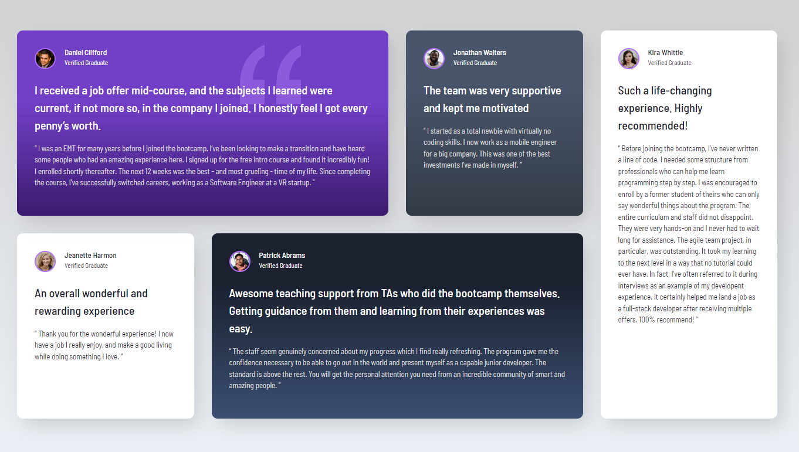

# Frontend Mentor - Testimonials grid section solution

This is a solution to the [Testimonials grid section challenge on Frontend Mentor](https://www.frontendmentor.io/challenges/testimonials-grid-section-Nnw6J7Un7). Frontend Mentor challenges help you improve your coding skills by building realistic projects. 

## Table of contents

- [Screenshot](#screenshot)
- [Links](#links)
- [My process](#my-process)
  - [Built with](#built-with)
  - [What I learned](#what-i-learned)

### Screenshot

### Link

- Live Site URL: [Add live site URL here](https://testimonials-grid-section-gamma-liart.vercel.app/)

## My process

### Built with

- Semantic HTML5 markup
- CSS custom properties
- CSS Grid

### What I learned

The best thing I learnt in this contest is how to set up the grid structure in CSS. how to use a hover effect that when hovering over an element affects all elements before and after that element. Using an effect that works like a generic sibling that also selects previous elements. You can see this in the focus effect I applied to the card section of my website.

